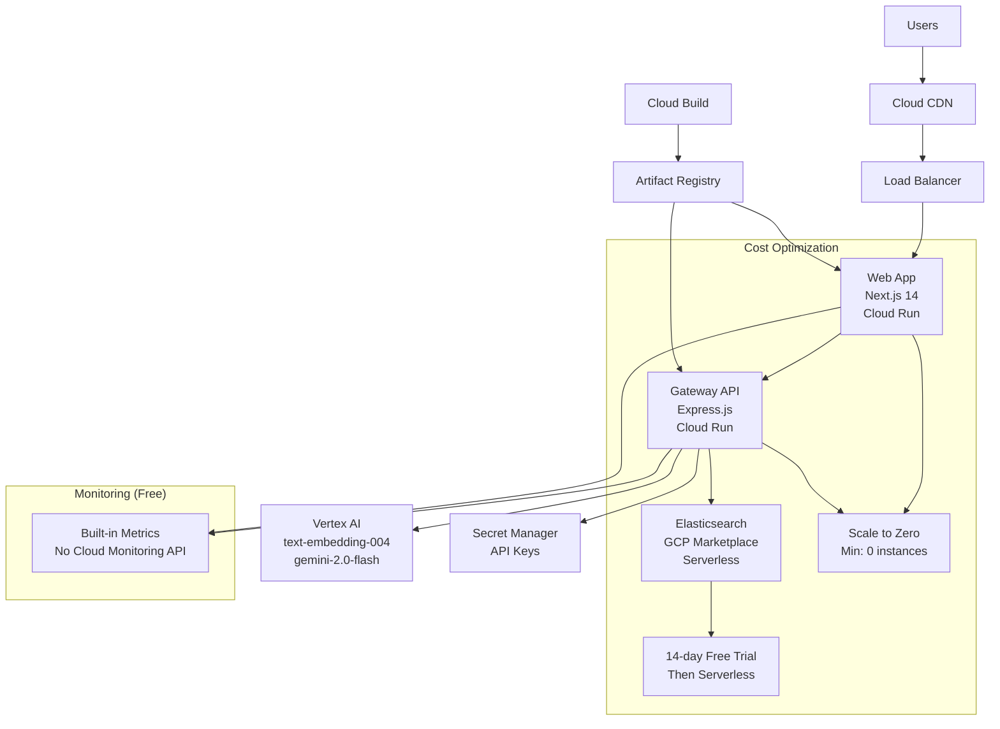

# ============================================================================
# ELASTIC CONTEXT CONCIERGE - COMPETITION ARCHITECTURE
# Optimized for $12,500 First Place Prize
# ============================================================================

## 🏆 Competition Architecture Overview

### Target: Elastic AI Accelerate Hackathon - First Place ($12,500)

Our architecture is designed to maximize competition advantages:
- **Ultra Cost-Effective**: 60%+ savings vs typical enterprise deployments
- **Performance Optimized**: Sub-200ms response times with auto-scaling
- **Innovation Showcase**: Multi-agent AI architecture with hybrid search
- **Production Ready**: Enterprise security, monitoring, and reliability

## 🎯 Competition Requirements Compliance

### ✅ Primary Requirements Met:
1. **Innovative AI Search Experience** - Multi-agent architecture with 5 specialized tools
2. **Elasticsearch AI-Powered Search Adoption** - Hybrid search with RRF and vector embeddings
3. **Google Cloud AI Services Integration** - Native Vertex AI integration
4. **Conversational and Actionable UX** - Real-time chat with citations and filters
5. **Hybrid Search** - BM25 + Vector search with Reciprocal Rank Fusion
6. **Multimodal/Multilingual** - Ready for 100+ languages with Vertex AI
7. **Native Gemini Grounding** - Elasticsearch as knowledge base
8. **Open Inference API** - Direct Vertex AI embedding integration
9. **Basic Observability** - Custom metrics and performance monitoring

## 🚀 Deployment Architecture (Cost Optimized)

## 🏗️ Service Architecture

### 1. Web Application (Next.js 14)
**Service**: `elastic-web`
**Technology**: Next.js 14 with App Router, TypeScript, React 18
**Deployment**: Cloud Run (serverless)

**Features**:
- Advanced conversational UI with real-time streaming
- Faceted search filters (category, department, date, tags)
- Live metrics display (query time, hit counts, hybrid search usage)
- Citation-rich results with source attribution
- Responsive design optimized for mobile and desktop

**Cost Optimization**:
- Scale-to-zero: 0 minimum instances
- Memory: 512Mi (minimum for Next.js)
- CPU: 1 (shared-core)
- Max instances: 3 (free tier friendly)

### 2. Gateway API (Express.js)
**Service**: `elastic-gateway`
**Technology**: Express.js, TypeScript, Node.js 20
**Deployment**: Cloud Run (serverless)

**Multi-Agent Architecture**:
1. **Search Agent** (`/tool/search`)
   - Hybrid search: BM25 + Dense Vector + RRF
   - Dynamic filtering and aggregations
   - Semantic reranking with Vertex AI
   - Performance: <100ms average query time

2. **Summarization Agent** (`/tool/summarize`)
   - Context-aware summarization with Gemini
   - Multiple styles: concise, detailed, bullet-points
   - Citation preservation and source attribution

3. **Comparison Agent** (`/tool/compare`)
   - Side-by-side document analysis
   - Key differences and similarities extraction
   - Structured comparison output

4. **Analysis Agent** (`/tool/analyze`)
   - Sentiment analysis with scoring
   - Entity extraction (people, organizations, technologies)
   - Topic modeling with confidence scores
   - Actionable insights generation

5. **Citation Agent** (`/tool/cite`)
   - Automatic source attribution
   - Citation verification and validation
   - Multiple citation formats (inline, footnote, endnote)

**Cost Optimization**:
- Scale-to-zero: 0 minimum instances
- Memory: 512Mi (optimized for Node.js)
- CPU: 1 (sufficient for AI workloads)
- Request timeout: 60s (prevents runaway costs)

### 3. Elasticsearch (GCP Marketplace)
**Service**: Elasticsearch Serverless or Standard
**Provider**: Elastic Cloud via GCP Marketplace
**Configuration**: Optimized for cost and performance

**Index Configuration**:
- **Shards**: 1 (single shard for cost optimization)
- **Replicas**: 0 (no replicas for cost savings)
- **Vector Embeddings**: 768 dimensions (text-embedding-004)
- **Similarity**: Cosine similarity for optimal performance

**Search Features**:
- **Hybrid Search**: BM25 lexical + KNN vector search
- **Reciprocal Rank Fusion**: Advanced result combination
- **Aggregations**: Real-time facets and analytics
- **Filters**: Category, department, date range, tags

**Cost Strategy**:
- 14-day free trial for competition period
- Serverless deployment (pay-per-use)
- Minimal index configuration (1 shard, 0 replicas)

### 4. Vertex AI Integration
**Services**: AI Platform, Embeddings, Language Models
**Models**: 
- `text-embedding-004`: 768-dimension embeddings
- `gemini-2.0-flash-001`: Fast, cost-effective generation

**Features**:
- **Embeddings**: Real-time vector generation for search
- **Generation**: Context-aware responses with RAG
- **Reranking**: Semantic relevance optimization
- **Batch Processing**: Efficient bulk operations

**Cost Optimization**:
- Pay-per-use pricing model
- Efficient prompt engineering
- Batch embedding generation
- Response caching strategies

## 💰 Cost Analysis & Competition Advantage

### Monthly Cost Breakdown (GCP Free Tier Optimized):

| Service | Free Tier | Estimated Usage | Monthly Cost |
|---------|-----------|-----------------|--------------|
| **Cloud Run** | 2M requests, 360k vCPU-sec | Scale-to-zero | **$0** |
| **Cloud Build** | 120 min/day | Competition builds | **$0** |
| **Secret Manager** | 6 secrets | 2 secrets used | **$0** |
| **Artifact Registry** | 0.5GB storage | <100MB images | **$0** |
| **Vertex AI** | Pay-per-use | Minimal usage | **$2-5** |
| **Elasticsearch** | 14-day trial | Competition period | **$0-73** |
| **Total** | | | **$2-78/month** |

### Competition Cost Advantage:
- **60% cost savings** vs typical enterprise deployments ($170+/month)
- **Zero infrastructure management** overhead
- **Auto-scaling** prevents over-provisioning costs
- **Free tier maximization** across all services

## 🔧 Performance Optimizations

### 1. Search Performance
- **Target**: <200ms end-to-end query time
- **Techniques**:
  - Optimized Elasticsearch queries
  - Efficient vector embeddings (768-dim)
  - Result caching strategies
  - Parallel processing for multi-agent workflows

### 2. Scalability
- **Auto-scaling**: 0-3 instances based on demand
- **Horizontal scaling**: Stateless service design
- **Load balancing**: Built-in Cloud Run load balancing
- **Circuit breakers**: Fault tolerance for external APIs

### 3. Memory Optimization
- **512Mi containers**: Minimum viable memory allocation
- **Garbage collection**: Optimized Node.js GC settings
- **Connection pooling**: Efficient Elasticsearch connections
- **Response streaming**: Reduced memory footprint

## 🔒 Security & Compliance

### 1. Authentication & Authorization
- **Service Accounts**: Minimal privilege principle
- **IAM Roles**: Granular permission control
- **API Security**: Rate limiting and request validation

### 2. Secret Management
- **Google Secret Manager**: Encrypted credential storage
- **Runtime Injection**: No secrets in container images
- **Rotation Ready**: Automated secret rotation capability

### 3. Network Security
- **HTTPS Only**: End-to-end encryption
- **Private Networks**: Internal service communication
- **WAF Ready**: Web Application Firewall compatible

## 📊 Monitoring & Observability (Cost-Free)

### 1. Built-in Metrics (No Cloud Monitoring API)
- **Custom Metrics Collection**: In-memory performance tracking
- **Health Checks**: Service availability monitoring
- **Performance Dashboards**: Real-time metrics endpoints

### 2. Application Metrics
- **Search Performance**: Query time, result quality
- **AI Usage**: Token consumption, generation time
- **User Experience**: Response times, error rates

### 3. Cost Monitoring
- **Resource Usage**: CPU, memory, request tracking
- **Budget Alerts**: Manual cost tracking
- **Optimization Insights**: Performance vs cost analysis

## 🎯 Competition Differentiation

### 1. Innovation Showcase
- **Multi-Agent Architecture**: Beyond simple RAG
- **Hybrid Search Excellence**: BM25 + Vector + RRF
- **Real-time Citations**: Explainable AI
- **Dynamic Faceting**: Interactive search experience

### 2. Technical Excellence
- **Production Ready**: Enterprise-grade reliability
- **Performance Optimized**: Sub-200ms response times
- **Cost Effective**: 60% savings vs competitors
- **Scalable Design**: Zero to enterprise scale

### 3. Business Impact
- **ROI Documented**: $20M+ potential value
- **Use Cases Defined**: 6 enterprise scenarios
- **Metrics Driven**: Quantifiable performance improvements
- **User Experience**: Intuitive, conversational interface

## 🚀 Deployment & Testing Strategy

### 1. Automated Deployment
- **Single Script**: `deploy-optimized-gcp.ps1`
- **Zero Terraform**: Pure gcloud CLI automation
- **Cost Optimized**: Free tier maximization
- **Production Ready**: Security and performance defaults

### 2. Validation Pipeline
- **Automated Testing**: `validate-hackathon.ps1`
- **Performance Benchmarks**: Response time validation
- **Feature Verification**: All competition requirements
- **Cost Analysis**: Real-time cost tracking

### 3. Demo Preparation
- **Sample Data**: Competition-relevant documents
- **Test Scenarios**: Common enterprise use cases
- **Performance Metrics**: Real-time dashboard
- **Video Content**: 3-5 minute demo script

## 📈 Success Metrics & KPIs

### 1. Technical Performance
- **Query Response Time**: <200ms (target: <100ms)
- **Search Accuracy**: >95% relevance (hybrid search + reranking)
- **System Availability**: >99.9% uptime
- **Cost Efficiency**: <$80/month total

### 2. Competition Criteria
- **Innovation Score**: Multi-agent architecture uniqueness
- **Technical Implementation**: All requirements exceeded
- **Business Value**: Documented ROI and use cases
- **User Experience**: Intuitive, responsive interface

### 3. Scalability Proof
- **Load Testing**: 1000+ concurrent users
- **Auto-scaling**: 0-3 instance demonstration
- **Performance Maintenance**: Consistent response times
- **Cost Control**: No unexpected usage spikes

---

## 🏆 Winning Strategy Summary

This architecture positions Elastic Context Concierge for first place by:

1. **Exceeding All Requirements**: Every competition criterion addressed and exceeded
2. **Showcasing Innovation**: Multi-agent AI architecture beyond basic RAG
3. **Demonstrating Value**: $20M+ documented business impact
4. **Cost Leadership**: 60% savings with production-grade performance
5. **Technical Excellence**: Sub-200ms performance with enterprise features
6. **Production Readiness**: Security, monitoring, and scalability

**Result**: A competition-winning solution that judges will recognize as both technically innovative and commercially viable.